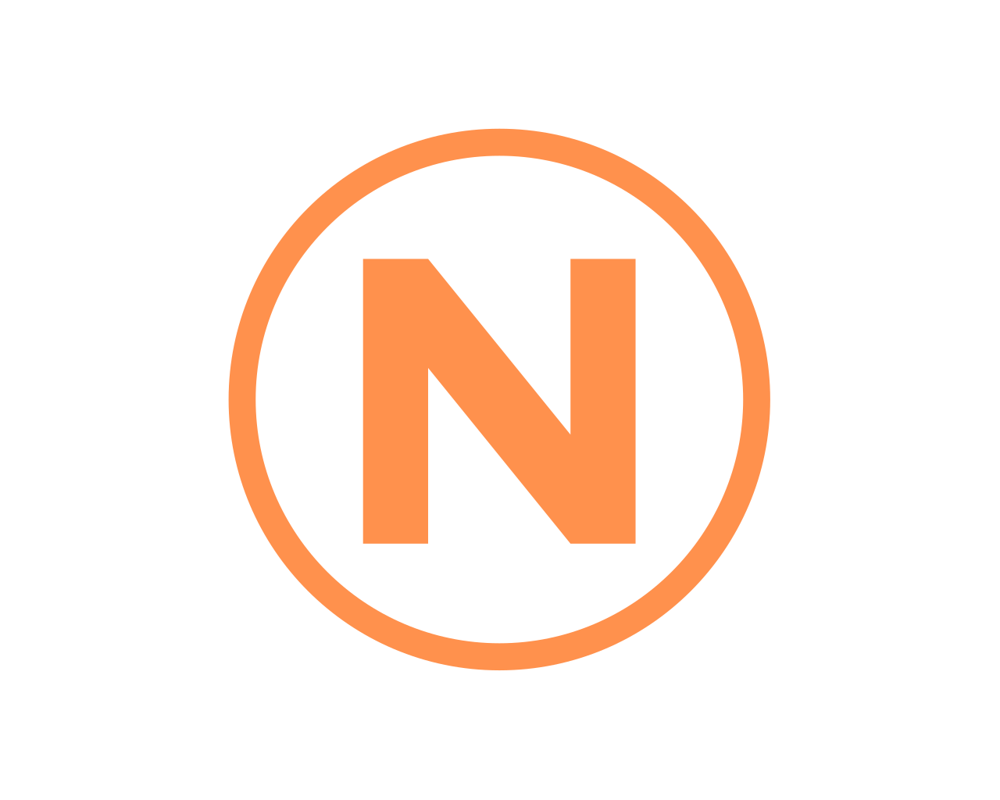

# NoaToDo

> **A local, encrypted to-do app for Windows.** Your tasks live in a single encrypted vault file on your own machine. No cloud, no account, no sync, no telemetry, and no outbound network connection of any kind.

NoaToDo looks roughly like Microsoft To Do and behaves nothing like it underneath. Everything you type is stored in `tasks.db.enc`, a ChaCha20-Poly1305 envelope around a SQLCipher AES-256 database, unlocked by a passphrase that is bound to your Windows account. The app locks itself, wipes its own browser profile on every teardown, and tells you honestly what it cannot protect you from.

## Screenshots

<!-- TODO(noa): Vier Screenshots aufnehmen und nach docs/ legen. Die Pfade unten
     stimmen schon, es fehlen nur die Bilder. Vorschlag fuer die Motive:
       docs/screenshot-lists.png     Liste mit Aufgaben, Sidebar offen, Rail rechts
       docs/screenshot-lock.png      natives Sperrfenster mit Ring und Passwort-Pille
       docs/screenshot-status.png    Status-Modal mit den echten Verschluesselungszeilen
       docs/screenshot-onboarding.png  Einrichtung Schritt 2 (Passphrase + Warnung)
     Alternativ per Drag and Drop in eine GitHub-Issue hochladen und die
     user-attachments-URLs eintragen, so wie beim Silicant-README. -->

| Lists | Lock screen | Status | Setup |
|:--:|:--:|:--:|:--:|
|  |  |  |  |

## Features

### Tasks and lists
- **Lists and tasks, nothing else.** A task is text plus a done flag. No due dates, no reminders, no sub-items, no metadata field. That is a decision, not a gap.
- **Open and completed are separate sections** with their own ordering. Checking a task off appends it to the end of the completed section; reopening appends it to the end of the open section.
- **Drag to reorder** tasks inside a list, and drag sidebar entries to reorder the lists themselves.
- **Move a task to another list** by dragging it onto a sidebar entry, or via right-click and "Move to...".
- **Inline editing** on double-click, click to select, and a contextual right-hand rail whose pencil edits the selected task or renames the list when nothing is selected.
- **Undo for a deleted list.** One toast, about six seconds, with a countdown bar. It is the only toast the app has.
- **Focus mode** (`F`) hides the sidebar and the rail, and **mini mode** shrinks the window to a compact always-on-top strip.

### Security
- **Always encrypted.** There is no unencrypted mode and no way to turn encryption off. Both layers are always present.
- **Lock screen** on every start, on `Ctrl+L`, and after an inactivity timeout you choose (default 15 minutes, `0` disables it). The timer runs in the backend on a monotonic clock, so a hung or compromised frontend can delay the lock but never prevent it.
- **The lock is enforced in the backend**, not in the UI: while locked, every bridge method except a short explicit allowlist returns `locked`, and `get_state()` returns nothing but `{ locked: true }`.
- **Panic button** clears the screen, switches the radios off for real, and ends in a screen with two exits: quit, or a two-stage killswitch that irreversibly deletes every list, task and setting.
- **Reset from the lock screen** for a forgotten passphrase: type `RESET`, and the vault, its backup, the config and the key pepper are deleted, then setup starts over.
- **Hardened copy.** The rail's copy button writes a single task to the clipboard through a backend Win32 path that excludes it from the Windows clipboard history and from cloud clipboard sync, and clears it after 60 seconds.
- **No DevTools in a release build.** The debug switch is a build constant, so an environment variable cannot open a console with full bridge access. Browser accelerator keys (including `Ctrl+P`, which would be a plaintext PDF export) and the default context menu are off as well.
- **Frontend integrity check.** Every HTML, JS, CSS and font file is hashed at build time into a manifest embedded in the binary and re-checked at startup. On a mismatch the app refuses to start, with no "continue anyway" button.

### Interface
- **Every window carries the app design**, including the native ones. The lock screen and the message windows are drawn by the app itself (DWM dark caption, the app grid, self-drawn pill controls), so nothing pops up looking like plain Windows.
- **Seamless window handovers.** Switching between the main window and the lock window puts up a matching curtain first, so the screen never goes empty and nothing appears to minimise.
- **Theme follows Windows** by default and switches live when you change the system theme, or you pin it to light or dark.
- **Six accent colours**, two density settings, a resizable sidebar, and a completion sound synthesised in the Web Audio API (no bundled audio file, so the strict Content Security Policy stays intact).

### Export and radios
- **Export to Markdown or plain text**, either the current list or all of them, through a real Windows save dialog. Filenames are sanitised, output is UTF-8 without BOM and CRLF, and a setting decides whether completed tasks are included.
- **A real airplane mode.** The online/offline pill and the `G` key switch the actual WiFi, Bluetooth and mobile radios through the Windows radio APIs, read the state back, and report honestly when a radio refused or when the app was denied radio access. External changes made in Windows are mirrored back into the pill.

## Security model

### Encryption

| Layer | What |
|:--|:--|
| Outer | ChaCha20-Poly1305 (AEAD). The complete file header is authenticated as associated data. |
| Inner | SQLCipher / AES-256. What the outer layer decrypts is itself an encrypted database. |
| Key derivation | Argon2id, version 0x13, 256 MiB memory, 3 iterations, 4 lanes, 32-byte output, 16-byte per-vault salt |
| Second factor | A random 32-byte pepper in the Windows Credential Manager (DPAPI), mixed in before Argon2id via `HKDF-Extract(salt=pepper, ikm=passphrase)` |
| Domain separation | HKDF-SHA256 with two fixed labels derives the AES key and the ChaCha key separately, never as raw slices of one secret |

No passphrase and no verification hash is ever written to disk, so the vault file gives an attacker no oracle to test guesses against. An unlock is verified implicitly: the wrong passphrase makes the AEAD tag fail.

While unlocked, the working copy is itself a SQLCipher-encrypted file under `%LOCALAPPDATA%`, never plaintext and never in `%TEMP%`. Keys exist only in RAM, are `VirtualLock`ed after derivation, and are zeroed on every exit path. Writes are debounced by about three seconds with a hard cap of thirty, so sustained typing cannot postpone the write-back indefinitely.

Wrong-passphrase attempts are rate limited: two seconds after each try, three free tries, then a ladder of 10 s, 30 s, 1 min, 5 min, 15 min, 30 min, 1 h, 5 h, 10 h with two tries per stage. The state is persisted before the check runs, so killing the process mid-attempt does not dodge the count, and it survives a restart.

### Honest limits

This section is deliberately as prominent as the one above. A security claim the app cannot keep is treated as a bug in this project, even when nothing is technically broken.

- **The vault is bound to this Windows account.** The pepper lives in the Credential Manager, protected by DPAPI. Another PC or a fresh Windows profile means the data is gone, even with the correct passphrase. There is no recovery, no backdoor key and no support path.
- **The pepper makes an offline attack hopeless only as long as** the attacker has the vault file alone, or the disk is encrypted. Whoever holds the whole unencrypted disk can attack the DPAPI master key, whose strength then rests on your Windows password. If that falls, only the passphrase is left, expensive through Argon2id but alone.
- **BitLocker or Windows device encryption is effectively a prerequisite.** NoaToDo cannot reach the pagefile, the hibernation file or crash dumps. The app reads your real BitLocker state and shows it, and says "unknown" when it cannot read it rather than claiming anything.
- **Malware running in your own Windows account is an explicit non-goal.** Anything running as you can read the pepper, hook the keyboard, read unlocked process memory or swap out `app.js`. The hardening in this app (Content Security Policy, backend-enforced lock allowlist, hardened clipboard, frontend hash manifest, no DevTools in release) raises the bar and makes silent persistence harder. It is never sold as protection against this class.
- **This build is not code-signed.** Windows SmartScreen will warn on first run, and a tampered binary cannot be detected by a signature. Verify the SHA-256 checksum published with the release, or build it yourself.
- **The rate limit ladder slows down a person at your keyboard and nothing else.** Anyone who can copy the vault file guesses offline, where no ladder exists. Anyone with file access can delete the config and reset the ladder.
- **Exports write plaintext files.** That is what an export is for. Once saved, the file is outside the vault and outside this model.
- **Input fields stay selectable**, so their native `Ctrl+C` lands in the ordinary Windows clipboard. Only the rail's copy button takes the hardened path.

The full threat model, including the six attacker classes this app is written against and the reasoning behind each non-goal, is in [docs/threat-model.md](docs/threat-model.md).

## What NoaToDo deliberately does not do

- No cloud, no sync, no account, no telemetry, no crash reporting, no update check over the network.
- No notifications of any kind, neither in-app nor Windows toasts.
- No full-text search, no due dates, no reminders, no recurring tasks, no sub-items.
- No plausible deniability and no hidden second vault. Whoever genuinely fears coercion uses the killswitch.
- No claim of a wipe that did not happen. The panic end screen says "Workspace cleared", because that is what happened.
- No screenshot protection. It was built, it broke rendering on some GPU and driver combinations, and it never defended against the real threat, which is a phone camera. It will not come back.
- No lock on Windows session lock (`Win+L`), on minimise or on focus loss. The inactivity timer is the reliable lock and keeps running while the PC is locked.
- No auto-update. The status dialog names the source address in plain text and you check yourself.

## System requirements

- **OS:** Windows 10 or 11, 64-bit. This is a Windows-only app by construction, not by omission: DPAPI, WebView2, WinForms and the WinRT radio APIs have no portable equivalent, so a Linux or macOS port would be a rewrite rather than a port.
- **Microsoft Edge WebView2 runtime.** Present on current Windows 10 and 11. NoaToDo bundles no browser engine. If the runtime is missing, the app says so in a themed window and exits instead of showing a blank one.
- **RAM:** Argon2id allocates 256 MiB during unlock, so a machine with less free memory than that will report a memory error instead of failing silently.
- **Python 3.11.x**, only when running or building from source. The version is pinned: `sqlcipher3-wheels` ships wheels for specific CPython versions, and the build script refuses to run on anything else.
- **BitLocker or Windows device encryption** is strongly recommended, see the honest limits above.

## Installation

### Running from source

```powershell
git clone https://github.com/noagnos3-create/NoaToDo.git
cd NoaToDo\src
py -3.11 -m venv venv
venv\Scripts\python.exe -m pip install --require-hashes -r requirements.lock.hashes.txt
venv\Scripts\python.exe main.py
```

`run.ps1` does the same thing from anywhere: it always uses the project's own venv regardless of the current directory, so you can double-click it.

There is no build step. The frontend is plain HTML, CSS and JavaScript, loaded directly by PyWebView. Frontend edits need a full restart of the app; there is no hot reload.

### Building the standalone executable

```powershell
cd NoaToDo\src
venv\Scripts\python.exe -m pip install -r requirements-dev.txt
build.bat
```

`build.bat` can also be double-clicked and passes its arguments through (`build.bat --onedir --console` produces the debug variants, which are never shipped). The result is a single-file `dist\NoaToDo.exe` of roughly 20 MB, built with PyInstaller at optimisation level 2 (no docstrings, no asserts), with the icon and version resource embedded and without UPX.

Two things the build tells you honestly when it finishes, and they are worth repeating here: the executable is **not signed**, and it **assumes the WebView2 runtime** is already on the target machine.

## Usage

On first start NoaToDo runs a short setup: pick where the vault file should live, set a passphrase of at least twelve characters, confirm that you understand there is no recovery. Then you get an empty list view. No demo data is ever created.

### Keyboard shortcuts

| Action | Key |
|:--|:--|
| New task | `Enter` in the new-task field |
| New task in the open list | `Ctrl+N` (press again to close the field) |
| New list | `Ctrl+Shift+N` (press again to close the field) |
| Toggle sidebar | `Ctrl+B` |
| Focus mode | `F` |
| Switch list | `Ctrl+ArrowUp` / `Ctrl+ArrowDown` |
| Open list 1 to 9 | `Ctrl+1` to `Ctrl+9` |
| Lock the app | `Ctrl+L` |
| Export | `Ctrl+E` (scope, then format, then the save dialog) |
| Toggle theme | `Ctrl+J` |
| Online / offline | `G` |
| Shortcut help | `?` |
| Close everything | `Esc` |

Some things have no shortcut on purpose. The panic flow is reachable only through the rail button with its two-stage arming, so it cannot be triggered by a slip of the hand. Copying a task is the rail button only, because that is the hardened path. Mini mode is the rail button only, and `Esc` leaves it.

Mouse gestures: click selects a task, double-click edits it in place, drag reorders. Dragging a sidebar entry reorders the lists, and dragging a task onto a sidebar entry moves it there.

### Settings

Accent colour (six presets), appearance (auto, light or dark), density, completion sound, auto-lock interval (never, 1, 5, 15, 30 or 60 minutes), whether completed tasks appear in exports, and changing the passphrase. The status dialog next to it reports the real state: both encryption layers, the Argon2 parameters actually in use, whether the pepper is present, when the vault was last written, your BitLocker status, the WebView2 version, the app version and build date, and whether the binary is signed.

## Where your data lives

| What | Where | Encrypted |
|:--|:--|:--|
| Your tasks | `tasks.db.enc` in the folder you picked during setup | yes, both layers |
| Crash backup | `tasks.db.enc.bak` next to it | yes, both layers |
| Vault path, auto-lock interval, rate limit state | `%LOCALAPPDATA%\NoaToDo\config.json` | no, and it holds no task data |
| Key pepper | Windows Credential Manager, entry `NoaToDo` | DPAPI, tied to this Windows account |
| Working copy while unlocked | `%LOCALAPPDATA%\NoaToDo\work\` | yes (SQLCipher), securely deleted on lock |
| WebView2 profile | `%LOCALAPPDATA%\NoaToDo\webview` | no, holds only the app's own HTML, CSS, JS and GPU cache, wiped after every window teardown |

To remove NoaToDo completely: delete the vault file and its `.bak`, delete `%LOCALAPPDATA%\NoaToDo`, and delete the `NoaToDo` entry in the Windows Credential Manager. Doing it from inside the app is cleaner: the lock screen's reset does all three through the real teardown path.

## Built with

| Library | Version | Purpose |
|:--|:--:|:--|
| [pywebview](https://pywebview.flowrl.com/) | 5.3.2 | Native window around the WebView2 control, and the JavaScript to Python bridge |
| [sqlcipher3-wheels](https://pypi.org/project/sqlcipher3-wheels/) | 0.5.7 | SQLCipher / AES-256, the inner encryption layer, imported as `sqlcipher3` |
| [cryptography](https://cryptography.io/) | 48.0.0 | ChaCha20-Poly1305 and HKDF-SHA256, the outer layer and the key separation |
| [argon2-cffi](https://argon2-cffi.readthedocs.io/) | 25.1.0 | Argon2id key derivation from the passphrase |
| [keyring](https://github.com/jaraco/keyring) | 25.7.0 | The DPAPI pepper in the Windows Credential Manager, its only use |
| [PyWinRT](https://github.com/pywinrt/pywinrt) (`winrt-Windows.Devices.Radios` and friends) | 3.2.1 | The real airplane mode over the Windows radio APIs |
| [pythonnet](https://pythonnet.github.io/) | 3.1.0 | WinForms access for the native lock window and the app-themed message windows |
| Win32 via `ctypes` | stdlib | DWM titlebar, single-instance mutex, hardened clipboard, DPI awareness, `VirtualLock` |
| [PyInstaller](https://pyinstaller.org/) | 6.16.0 | Building the single-file executable, development only |
| [pytest](https://pytest.org/) | 8.4.2 | Test suite, development only |
| [Pillow](https://python-pillow.org/) | 12.2.0 | Generating `icon.ico` from the logo, development only |

Fonts: [JetBrains Mono](https://github.com/JetBrains/JetBrainsMono) and [Space Grotesk](https://github.com/floriankarsten/space-grotesk), bundled as local `.woff2` files. There is no font CDN, because that would be a network request.

## Project layout

```
NoaToDo/
├── assets/
│   └── noatodo-logo.png       source of frontend/icon.ico
├── docs/                      screenshots, architecture, threat model
└── src/                       run every command from here
    ├── main.py                entry point, boot loop, window wiring, navigation guard
    ├── buildinfo.py           version, release switch, bundle paths
    ├── integrity.py           startup hash check of the frontend against the manifest
    ├── lockwindow.py          native lock screen and the window handover curtain
    ├── wintheme.py            the one native look: tokens, DWM titlebar, pill controls
    ├── NoaToDo.spec           PyInstaller single-file build
    ├── build.bat, run.ps1     double-click entry points for building and starting
    ├── backend/
    │   ├── api.py             the bridge, input validation, error catalogue
    │   ├── config.py          the unencrypted config.json
    │   ├── db.py              SQLCipher schema and CRUD
    │   ├── ostheme.py         Windows light and dark state, with a watcher
    │   ├── radio.py           the real airplane mode over WinRT
    │   └── security.py        key derivation, vault session, locking, teardown
    ├── frontend/
    │   ├── index.html         Content Security Policy lives here
    │   ├── style.css
    │   ├── app.js             all UI logic, calls pywebview.api.*
    │   ├── icon.ico
    │   └── fonts/
    ├── tests/                 pytest
    └── tools/
        ├── build_exe.py       the one build entry point
        ├── lock_hashes.py     generates the hash-pinned requirements file
        ├── make_icon.py       icon.ico from assets/noatodo-logo.png
        ├── verify_crypto.py   standalone proof of the encryption, no pytest needed
        └── spike_u3_lockwindow.py
```

## Development

### Tests

```powershell
cd src
venv\Scripts\python.exe -m pytest
```

63 tests, about four seconds. They cover the database layer, input validation, the backend lock allowlist, the crypto (key derivation, container format, roundtrip, tamper detection), the rate limit ladder, the teardown and killswitch sequence, and a set of release checks.

Every test redirects anything that would touch real user data before it runs: `%LOCALAPPDATA%` goes to a temporary directory, and `keyring` is replaced by a stub that raises if anything calls it, because a test that reached the real credential store could delete your pepper and make your vault permanently unreadable. Argon2id runs at the cheap end of the accepted parameter range so the suite stays fast without leaving the range.

Not automated, and honestly so: anything that needs a real window (the file monitor, a hard process kill, the second-instance guard, the native dialogs, the release key checks) is a manual checklist, and the XSS test is the static one.

### Verifying the encryption yourself

```powershell
cd src
venv\Scripts\python.exe tools\verify_crypto.py
```

This is a standalone script with no test framework involved. It derives keys, writes a vault, reads it back, and demonstrates that a single flipped byte makes the decryption fail.

### Dependency files

There are four of them on purpose:

| File | What it is |
|:--|:--|
| `requirements.txt` | the loose list, with the reasoning for each choice in comments |
| `requirements.lock.txt` | every package pinned to an exact version |
| `requirements.lock.hashes.txt` | the same, plus a SHA-256 per artifact; this is what a release build installs, with `--require-hashes` |
| `requirements-dev.txt` | pytest, PyInstaller and Pillow, never part of the bundle |

Changing a version means editing `requirements.lock.txt` and re-running `tools\lock_hashes.py`, which downloads each artifact once and hashes it. It is deliberately not part of the build.

### Conventions

The frontend rebuilds its entire DOM on every render and dispatches interaction through delegated `data-act` attributes, so listeners attached after a render would be lost. Any value that reaches `innerHTML` must go through the `esc()` helper: the frontend has full access to the Python bridge, which makes an XSS effectively remote code execution against the backend. Native window mutations must be dispatched to the WinForms UI thread. All of this and more is in [docs/architecture.md](docs/architecture.md).

Code comments and docstrings are in German, the user interface and the documentation are in English. See [CONTRIBUTING.md](CONTRIBUTING.md).

## Contributing

Bug reports, questions and pull requests are welcome. Please read [CONTRIBUTING.md](CONTRIBUTING.md) first, and report security issues privately through [SECURITY.md](SECURITY.md) rather than as a public issue.

## License

<!-- TODO(noa): Lizenz eintragen, sobald LICENSE liegt. Vorschlag aus der Analyse:
     GPL-3.0-or-later, wie bei Silicant. Dieser Abschnitt und die LICENSE-Datei
     muessen zusammenpassen, bevor das Repository oeffentlich wird. -->

Not yet licensed. A `LICENSE` file will be added before this repository is made public. Until then, no permission to use, copy, modify or distribute this code is granted.
